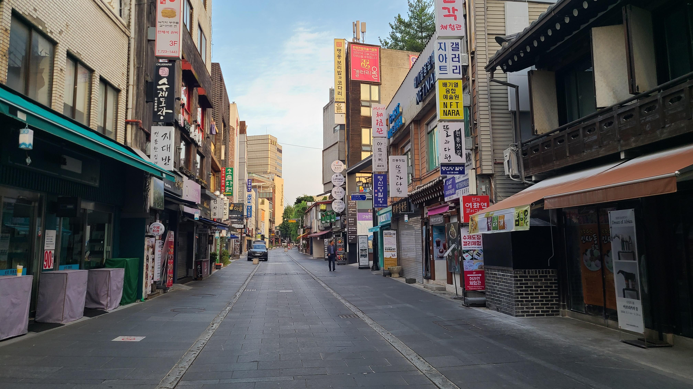
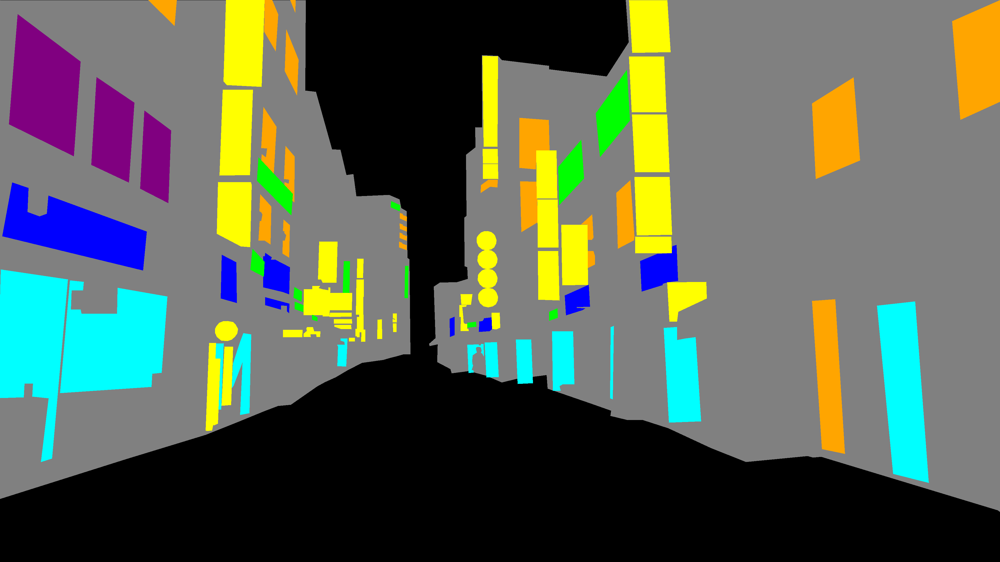
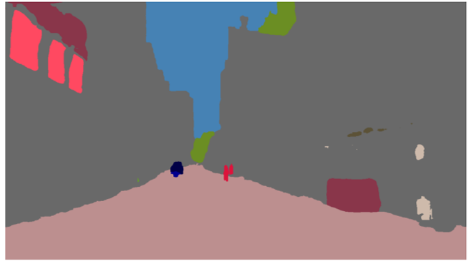
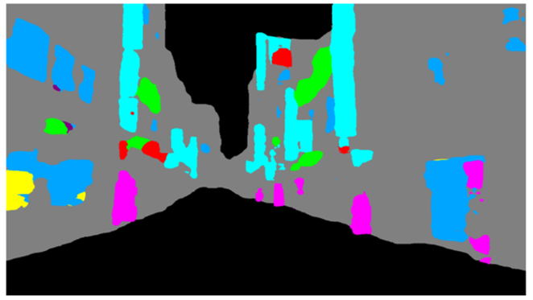
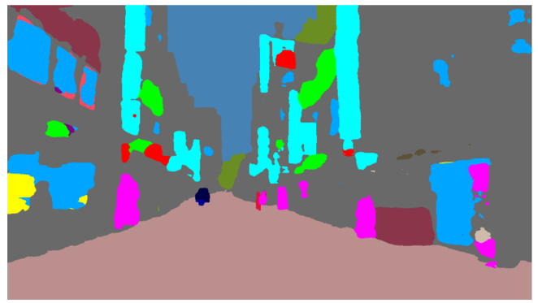

# UrbanFacade: Façade-based Streetscape Indices from Street-Level Images

---

## Table of Contents

* [Overview](#overview)
* [Examples](#examples)
* [Setup](#setup)
* [Runtime Environment](#runtime-environment)
* [Source Code](#source-code)
* [Acknowledgement](#acknowledgement)

---

## Overview

The core script is ['main.py'](main.py), which:

1. Loads the **COCO benchmark** and **UrbanFacade** segmentation model.
2. For each image in the 'input' folder:
   - Runs both models and creates **benchmark**, **façade**, and **combined** segmentation maps.
   - Computes **Transparency, Harmony, and Complexity** indices from the combined segmentation.
   - (Optionally) computes **PlacePulse-based perceptual scores** (Beautiful, Boring, Depressing, Lively, Safe, Wealthy).
3. Saves visualization images and a summary table with all indices into the 'output' folder.

---

## Examples

| Original image | Ground truth |
|---------|--------------|
|  |  |

| Benchmark model | Facade model |
|-----------|--------|
|  |  |

| Combined output (UrbanFacade model) |
|-----------------|
|  |

---

## Setup

* **COCO benchmark model**: This repository does *not* include the TensorFlow-based COCO segmentation model ('resnet50_kmax_deeplab_coco_train') due to size and redistribution constraints. Users must manually download the model from [this link](https://storage.googleapis.com/gresearch/tf-deeplab/saved_model/resnet50_kmax_deeplab_coco_train.tar.gz) and place the extracted folder into the 'model' directory.

* **UrbanFacade model**: The file 'UrbanFacade.pth' is *already* stored in the 'model' directory via Git LFS.

* **PlacePulse model**: Public release of this repository does not redistribute the PlacePulse model weights due to dataset and licensing considerations. The PlacePulse-based perceptual scores are therefore *disabled* by default in this code.

---

## Runtime Environment

* Operating System: Windows 10 / 11
* Python version: 3.8.10
* Hardware requirements:

  * Optional NVIDIA GPU (CUDA 11.8 compatible)
  * If no GPU is available, the program automatically uses CPU

* Memory: At least 8 GB RAM recommended
* Dependencies:

  * 'tensorflow'
  * 'torch', 'torchvision', 'torchaudio'
  * 'albumentations', 'opencv-python-headless', 'pillow', 'scikit-image'
  * 'tqdm', 'matplotlib', 'pandas', 'numpy'

---

## Source Code

* The '**source**' folder contains source codes for model preprocessing, training, and prediction.
* All scripts in this folder were created and tested based on **Google Colab** environment.
* Thus, it may include Google Colab-specific configurations such as mounted paths and dependencies.

---

## Acknowledgement

* This repository accompanies the manuscript authored by **Jihun Oh** (first author) and **Jaewoong Won** (corresponding author).  
* The development of this code was supported by the Smart Urban & Real Estate Lab. at Kyung Hee University.
* If you use this code, please cite our paper once it becomes available.